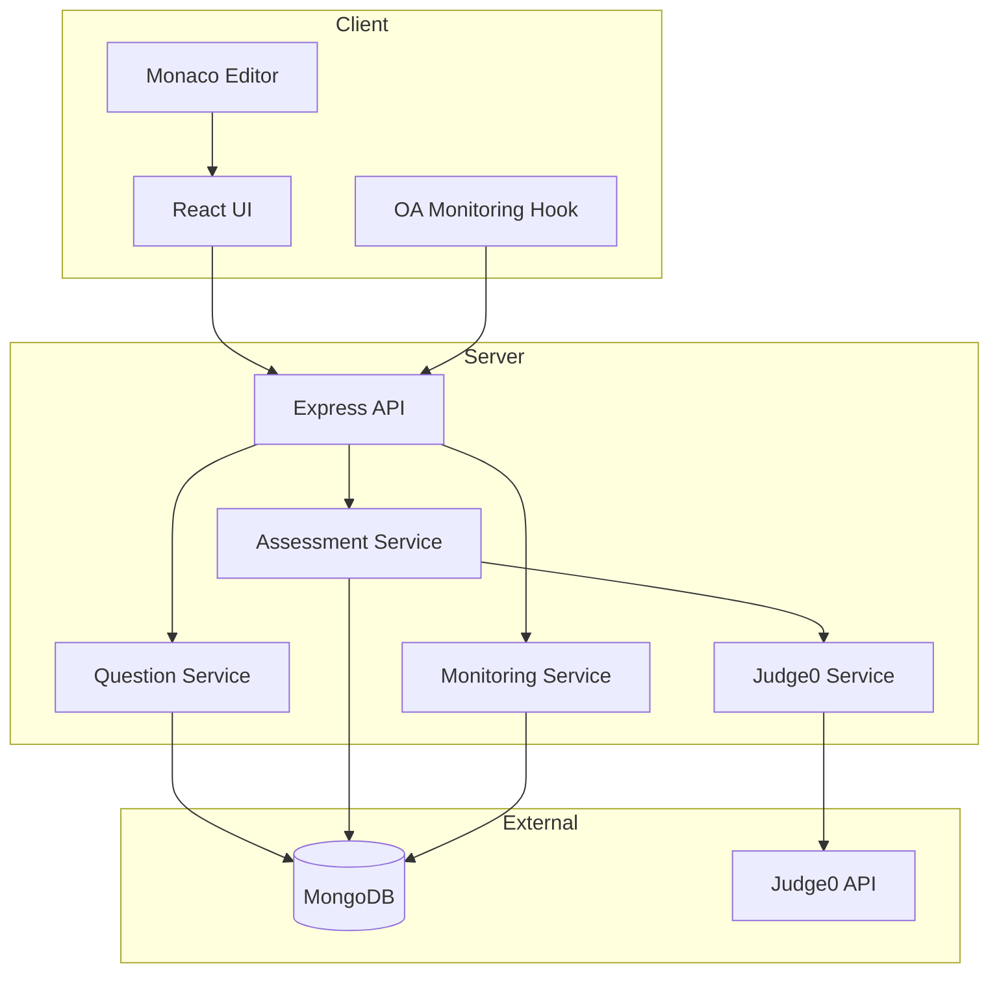

# Architecture Overview

## System Components

## Data Models

- **Question** — Problem statements, starter code, test cases
- **AssessmentSession** — Active assessment tracking
- **Submission** — Evaluated code submissions
- **MonitoringEvent** — OA compliance events

## Evaluation Flow

1. User submits code via `POST /api/assessment/submit`
2. Server runs all test cases (sample + hidden) through Judge0
3. Outputs are sanitized by `evaluateUserSubmission(userStdout, expectedOutput)` and compared locally with strict equality
4. Result stored in Submission collection
5. Client navigates to results page with monitoring summary

GeeksforGeeks HTML parsing uses Gemini with a primary `gemini-2.5-flash` call and a `gemini-1.5-flash-8b` fallback. Correctness checks do not call AI.

## OA Monitoring (Client-Side)

Browser APIs used:

- `requestFullscreen()` / `fullscreenchange`
- `getUserMedia()` for camera/microphone
- `visibilitychange` for tab switching
- `blur`/`focus` for window focus
- `screen.isExtended` and screen dimensions for multi-monitor approximation

All events are logged to the backend via `POST /api/monitoring/event`.

## Known Limitations

| Feature | Limitation |
|---------|------------|
| Multi-monitor detection | Informational only; browsers restrict accurate detection |
| No authentication | By design per SRS; sessions are anonymous |
| Judge0 dependency | Required for code execution |
